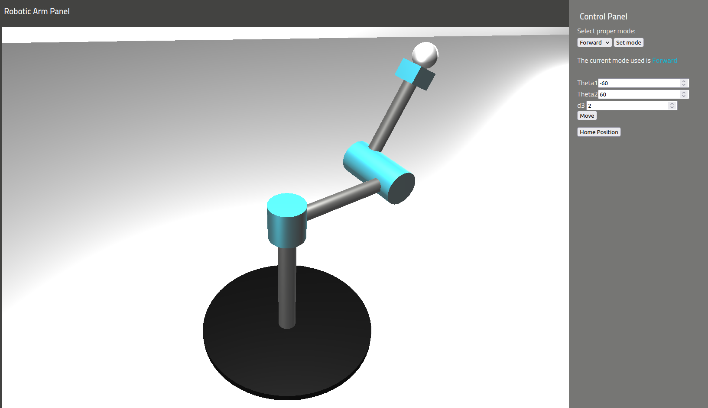
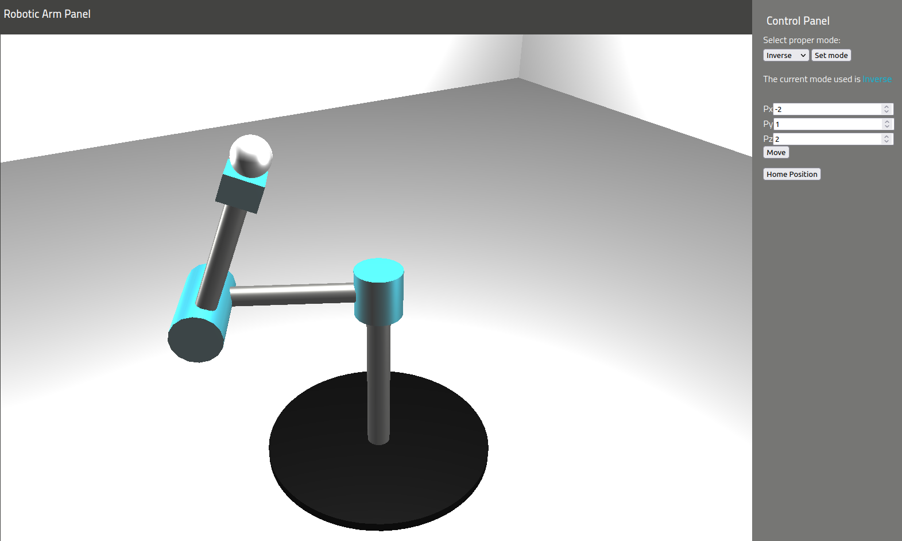

# bison
Robotic arm simulation for Robotics Exercises at Poznan University of Technology.

## Overview
Robotic manipulator with 3 DOF, implemented as visualization tool for Jacobian matrices calculations.
It supports operations for Forward and inverse kinematics. Robot has 2 rotational joints and 1 prismatic.

